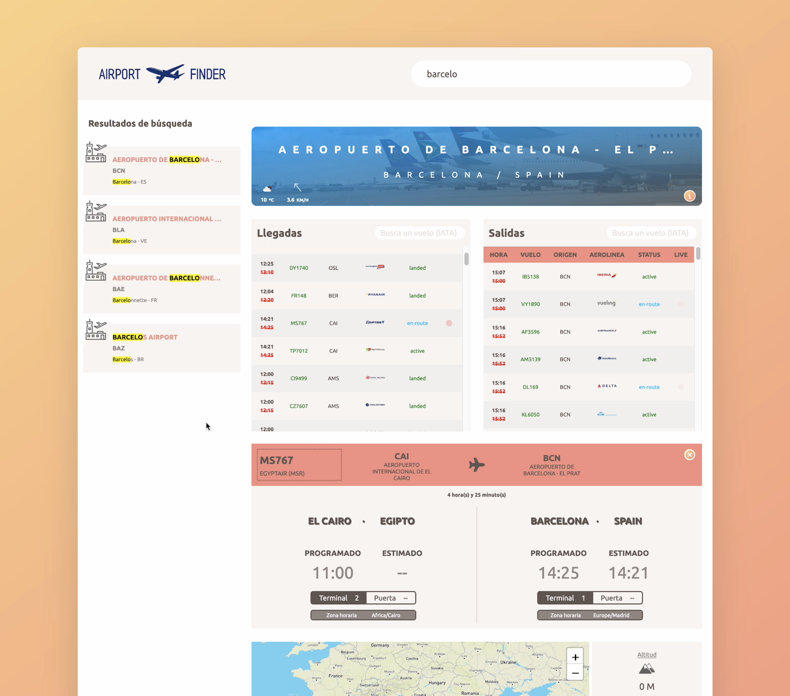
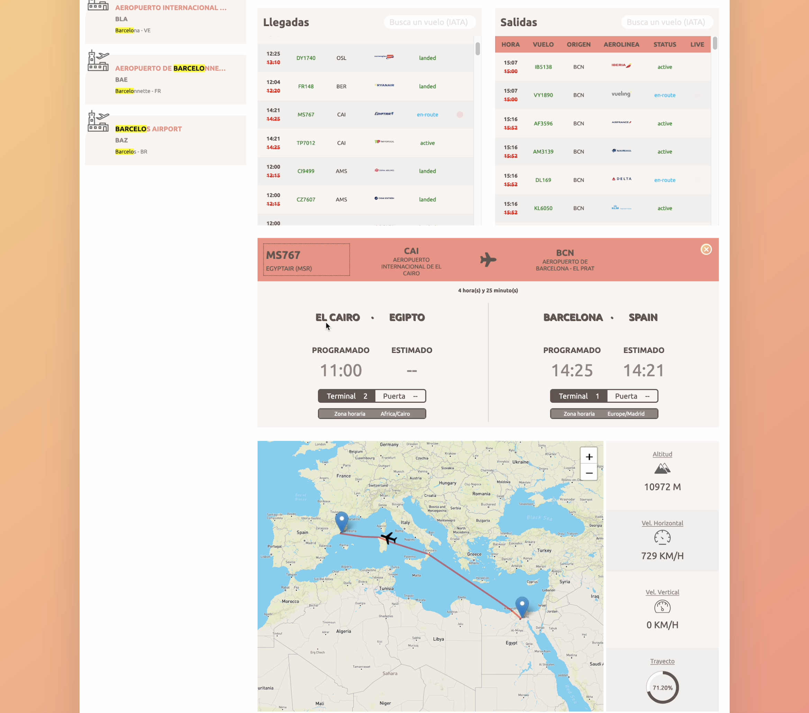

# Airport Finder

Airport finder is a web application that allows you to search among thousands of airports around the world and track thousands of flights in real time. 

## How to build
- Enter your API KEYS in the [config.js](./src/js/config.js) file
- Make sure you have npm installed
- Run the `npm install` command from the project root directory to download the dependencies
- Run the `npm start` command from the root directory of the project
- Once the build is done Parcel will start the local server on port 1234 (it'll choose another one if it is busy) <http://localhost:1234>

## Screenshots

 
